# StoryBoard App - User Flow Diagram

```mermaid
flowchart TD
    Start([User Opens App]) --> Auth{Authenticated?}
    
    Auth -->|No| Login[Login Screen]
    Auth -->|No| Signup[Signup Screen]
    
    Login --> ValidateLogin{Valid Credentials?}
    Signup --> ValidateSignup{Valid Registration?}
    
    ValidateLogin -->|Yes| Dashboard
    ValidateLogin -->|No| LoginError[Show Error Message]
    LoginError --> Login
    
    ValidateSignup -->|Yes| Dashboard
    ValidateSignup -->|No| SignupError[Show Error Message]
    SignupError --> Signup
    
    Auth -->|Yes| Dashboard[Dashboard Screen]
    
    Dashboard --> ProjectList[View All Projects]
    ProjectList --> SelectProject{Select Project}
    
    SelectProject --> ProjectDashboard[Project Dashboard]
    
    ProjectDashboard --> Feature1[Script Breakdown]
    ProjectDashboard --> Feature2[Storyboard]
    ProjectDashboard --> Feature3[Shot List]
    ProjectDashboard --> Feature4[Schedule]
    ProjectDashboard --> Feature5[Budget]
    ProjectDashboard --> Feature6[Locations]
    ProjectDashboard --> Feature7[Export]
    ProjectDashboard --> Settings[Settings/Profile]
    
    %% Script Breakdown Flow
    Feature1 --> ScriptActions{Script Action}
    ScriptActions --> UploadScript[Upload Script File]
    ScriptActions --> EditScript[Edit Script]
    ScriptActions --> GenerateBreakdown[AI Generate Breakdown]
    UploadScript --> ScriptSaved[Script Saved]
    EditScript --> ScriptSaved
    GenerateBreakdown --> ScriptSaved
    ScriptSaved --> ProjectDashboard
    
    %% Storyboard Flow
    Feature2 --> StoryboardView{View Mode}
    StoryboardView --> GridView[Grid View]
    StoryboardView --> TimelineView[Timeline View]
    
    GridView --> SelectScene[Select Scene]
    TimelineView --> SelectScene
    
    SelectScene --> StoryboardActions{Storyboard Action}
    StoryboardActions --> AddPanel[Add Panel]
    StoryboardActions --> EditPanel[Edit Panel]
    StoryboardActions --> DeletePanel[Delete Panel]
    StoryboardActions --> GenerateAI[AI Generate Panel]
    
    AddPanel --> PanelForm[Fill Panel Details:<br/>- Shot Type<br/>- Camera Movement<br/>- Camera Angle<br/>- Duration<br/>- Description]
    EditPanel --> PanelForm
    GenerateAI --> PanelForm
    
    PanelForm --> SavePanel[Save Panel]
    SavePanel --> StoryboardView
    DeletePanel --> StoryboardView
    
    %% Shot List Flow
    Feature3 --> ShotListView[View Shot List]
    ShotListView --> ShotActions{Shot Action}
    
    ShotActions --> AddShot[Add New Shot]
    ShotActions --> EditShot[Edit Shot]
    ShotActions --> DeleteShot[Delete Shot]
    ShotActions --> FilterShots[Filter by Scene/Type]
    
    AddShot --> ShotForm[Fill Shot Details:<br/>- Shot Number<br/>- Scene<br/>- Shot Type<br/>- Camera Angle<br/>- Camera Movement<br/>- Equipment<br/>- Description]
    EditShot --> ShotForm
    
    ShotForm --> SaveShot[Save Shot]
    SaveShot --> ShotListView
    DeleteShot --> ShotListView
    FilterShots --> ShotListView
    
    %% Schedule Flow
    Feature4 --> ScheduleView[View Schedule]
    ScheduleView --> ScheduleActions{Schedule Action}
    
    ScheduleActions --> AddSchedule[Add Schedule Item]
    ScheduleActions --> EditSchedule[Edit Schedule]
    ScheduleActions --> DeleteSchedule[Delete Schedule]
    ScheduleActions --> CalendarView[Calendar View]
    
    AddSchedule --> ScheduleForm[Fill Schedule Details:<br/>- Date<br/>- Time<br/>- Scene<br/>- Location<br/>- Cast & Crew<br/>- Notes]
    EditSchedule --> ScheduleForm
    
    ScheduleForm --> SaveSchedule[Save Schedule]
    SaveSchedule --> ScheduleView
    DeleteSchedule --> ScheduleView
    CalendarView --> ScheduleView
    
    %% Budget Flow
    Feature5 --> BudgetView[View Budget Dashboard]
    BudgetView --> BudgetCategories[View Categories:<br/>- Cast<br/>- Crew<br/>- Equipment<br/>- Locations<br/>- Post-Production<br/>- Miscellaneous]
    
    BudgetCategories --> BudgetActions{Budget Action}
    
    BudgetActions --> AddExpense[Add Expense]
    BudgetActions --> EditExpense[Edit Expense]
    BudgetActions --> DeleteExpense[Delete Expense]
    BudgetActions --> ViewTotal[View Total/Spent]
    
    AddExpense --> ExpenseForm[Fill Expense Details:<br/>- Description<br/>- Category<br/>- Amount<br/>- Status<br/>- Date]
    EditExpense --> ExpenseForm
    
    ExpenseForm --> SaveExpense[Save Expense]
    SaveExpense --> BudgetView
    DeleteExpense --> BudgetView
    ViewTotal --> BudgetView
    
    %% Locations Flow
    Feature6 --> LocationsView[View Locations Map]
    LocationsView --> LocationFilter[Filter by:<br/>- Type<br/>- Status<br/>- Availability]
    
    LocationFilter --> LocationActions{Location Action}
    
    LocationActions --> AddLocation[Add Location]
    LocationActions --> EditLocation[Edit Location]
    LocationActions --> DeleteLocation[Delete Location]
    LocationActions --> ViewMap[View on Map]
    
    AddLocation --> LocationForm[Fill Location Details:<br/>- Name<br/>- Type<br/>- Address<br/>- Status<br/>- Contact<br/>- Cost<br/>- Notes]
    EditLocation --> LocationForm
    
    LocationForm --> SaveLocation[Save Location]
    SaveLocation --> LocationsView
    DeleteLocation --> LocationsView
    ViewMap --> LocationsView
    
    %% Export Flow
    Feature7 --> ExportOptions{Export Type}
    
    ExportOptions --> ExportScript[Export Script]
    ExportOptions --> ExportStoryboard[Export Storyboard]
    ExportOptions --> ExportShotList[Export Shot List]
    ExportOptions --> ExportSchedule[Export Schedule]
    ExportOptions --> ExportBudget[Export Budget]
    ExportOptions --> ExportAll[Export All]
    
    ExportScript --> FormatChoice{Choose Format}
    ExportStoryboard --> FormatChoice
    ExportShotList --> FormatChoice
    ExportSchedule --> FormatChoice
    ExportBudget --> FormatChoice
    ExportAll --> FormatChoice
    
    FormatChoice --> PDF[PDF]
    FormatChoice --> Excel[Excel]
    FormatChoice --> JSON[JSON]
    
    PDF --> Download[Download File]
    Excel --> Download
    JSON --> Download
    
    Download --> ProjectDashboard
    
    %% Settings Flow
    Settings --> SettingsOptions{Settings Option}
    SettingsOptions --> Profile[Edit Profile]
    SettingsOptions --> Preferences[App Preferences]
    SettingsOptions --> Logout[Logout]
    
    Profile --> UpdateProfile[Update Name/Email/Password]
    UpdateProfile --> Dashboard
    
    Preferences --> UpdatePrefs[Update Settings]
    UpdatePrefs --> Dashboard
    
    Logout --> Login
    
    %% Return to Dashboard
    ShotListView --> ProjectDashboard
    ScheduleView --> ProjectDashboard
    BudgetView --> ProjectDashboard
    LocationsView --> ProjectDashboard
    StoryboardView --> ProjectDashboard
    
    style Start fill:#e1f5ff
    style Dashboard fill:#fff4e1
    style ProjectDashboard fill:#e8f5e9
    style Feature1 fill:#f3e5f5
    style Feature2 fill:#f3e5f5
    style Feature3 fill:#f3e5f5
    style Feature4 fill:#f3e5f5
    style Feature5 fill:#f3e5f5
    style Feature6 fill:#f3e5f5
    style Feature7 fill:#f3e5f5
    style Settings fill:#ffe5e5
    style Download fill:#c8e6c9
    style Logout fill:#ffcdd2
```



## User Journey Overview

### 1. **Authentication Flow**
- User opens app → Check if logged in
- If not logged in → Login or Signup
- Validate credentials → Access Dashboard

### 2. **Main Dashboard**
- View all projects
- Select a project to work on
- Access project-specific features

### 3. **Feature Access Matrix**

| Feature | Key Actions | Output |
|---------|-------------|--------|
| **Script Breakdown** | Upload, Edit, AI Generate | Script breakdown with scenes |
| **Storyboard** | Add/Edit Panels, Grid/Timeline View | Visual scene representation |
| **Shot List** | Add/Edit/Delete Shots, Filter | Organized shot database |
| **Schedule** | Add/Edit Schedule, Calendar View | Production timeline |
| **Budget** | Add/Edit Expenses, Track Spending | Financial overview |
| **Locations** | Add/Edit Locations, Map View | Location database with map |
| **Export** | Export to PDF/Excel/JSON | Downloadable documents |
| **Settings** | Profile, Preferences, Logout | User management |

### 4. **Data Flow**
```
User Input → Frontend (Next.js/Redux) → Backend API (Express) → MongoDB Atlas → Response → UI Update
```

### 5. **Key User Interactions**

#### Storyboard Creation Flow:
1. Select project → Storyboard
2. Choose Grid or Timeline view
3. Select scene
4. Add panel with details (shot type, camera angle, movement, duration)
5. AI can generate panel suggestions
6. Save and view in layout

#### Budget Management Flow:
1. Select project → Budget
2. View categories and spending overview
3. Add expense with description, category, amount
4. Track total budget vs spent
5. Update status (pending/approved/paid)

#### Location Scouting Flow:
1. Select project → Locations
2. View locations on map
3. Add location with type, address, status
4. Filter by availability
5. Track booking status

### 6. **Permission-Based Access**
- JWT authentication on all API calls
- User permissions: read, write, delete
- Protected routes enforce authorization

### 7. **Export Options**
Users can export any feature data in multiple formats:
- **PDF**: Professional formatted documents
- **Excel**: Spreadsheet for editing
- **JSON**: Raw data for integrations

